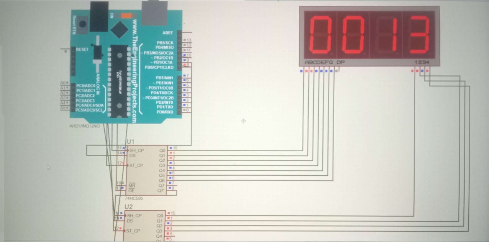

# ShiftRegister-7Segment-Timer

This Arduino project displays a 4-digit counter using shift registers and 7-segment displays. The counter increments every second and updates the display using multiplexing and bitwise operations.

## Features

- Displays numbers from 0000 to 9999
- Uses 7-segment displays with shift registers
- Simple, clean multiplexing technique
- Fully written in Arduino C

## Hardware Required

- Arduino Uno (or compatible)
- 4 x 7-Segment Displays (Common Cathode)
- 2 x 74HC595 Shift Registers
- Resistors (current limiting)
- Jumper wires and breadboard

## Circuit

Each digit of the 7-segment display is controlled using shift registers. The shiftOut function is used to control which digit is active and what number it displays.

## 🖼 Circuit Diagram

## How It Works

- The count variable increments every 1000 ms (1 second).
- The value is split into 4 digits and displayed using shiftOut.
- Multiplexing is handled by activating one digit at a time with a short delay.

## Setup

1. Connect your circuit as described above.
2. Open the `.ino` file in Arduino IDE.
3. Upload to your Arduino board.
4. Watch the counter increment every second!

## License

This project is licensed under the MIT License - see the [LICENSE](LICENSE) file for details.
